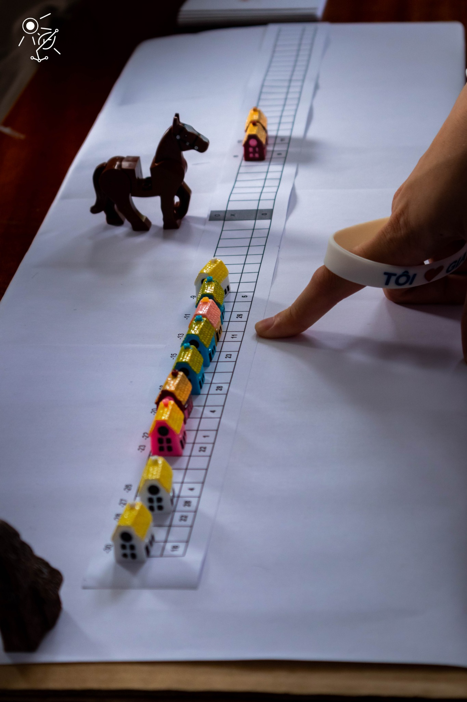

# ACM Gia Định at Science Fair 2022

In 20/05/2022, we – ACM Gia Định Team – had a chance to set up a stall at the Science Fair hosted by Gia Dinh High School. At this event, we proudly brought to the fair's participants a nice problem where everyone can interact and try a variety of approaches, as well as being able to relate to many interesting practice problem.

## To-do
- Update more event images
- Update environment setup
- Finish current left parts with only title
- Update pseudo-code for each approach
- Refactor code for better view on purposes

## Problem
A group of Interworld Heroes are making their way through a village. Suddenly, afflatus tells them something is coming. Listening carefully to the portent, the Heroes find out that devils are coming to the houses on the road they are standing. They also know exactly which time the devils approach for each of the houses. The problem is the Heroes cannot move quick enough to rescue all the houses and they must be together for maximum strength. To be precise, there is a maximum speed that they cannot exceed. Therefore, they have to set a journey to rescue as many houses as possible.

### Player's Perspective
For simplicity, in the problem version at Science Fair, we decided to fix the maximum speed of the Heroes to $5$ (length unit per time unit).

The players were given a paper strip for each problem instance including coordinates from $-30$ to $30$ on an axis and the corresponding attacked times at the positions of each house, as well as some house models placed on it.

### Input Format
You could view the samples that we used at Science Fair in folder [problem instances](/problem%20instances/), or use them as inputs to your code. Assuming that the Heroes are at the coordinate $0$, the samples are in the following format:
- The first line contains two integers $V$ and $N$ representing the maximum speed of the Interworld Heroes (since we fixed the number, $V$ in every sample is $5$) and the number of houses on the road.
- The second line contains $N$ integers representing the corresponding coordinates of $N$ houses.
- The third line contains $N$ integers representing the corresponding attacked time of $N$ houses, counted from the present.

## Environment Setup

## Discussion
### Greedy Approach: Trial and Error Method
Let's say a journey of rescuing houses is a list of houses that we will come and rescue in order.

It is clear that we should not put a house with a very late attacked time at the beginning since that means we would abandon all the houses with earlier attacked time. Hence, we should look at the earliest next houses being attacked. Then we could try moving to one of them and repeating the process. To make sure that our solution is optimal, we could get back to some steps, try another house in the next move and continue the same as what we did.

We always tell our players to try this method multiple times without hesitating. This method will help you understand the problem and get familiar with the set of data to be processed. Moreover, one of the wonderful things about our human-being brains is that it will magically do some heuristic optimisations and cache some useful information for better performance every time we try solving the problem. So the more you try it, the faster and easier you get to solve it.

### Dynamic Programming Approach
Let's change the perspective a little bit. Instead of looking for the earliest next house to come, we could look for the previous house from which we will move to where we are standing.

So, how exactly does this point of view help us? Let's define a value of maximum number of houses that we are able to rescue for each house when we reach it (including itself), namely $F_H$ for the house $H$. Since we can only move from a house $A$ with earlier attacked time to another house $B$ with later attacked time to rescue both, this means only $B$ could be reached from $A$ but not the other way around. This observation suggests us to calculate $F$ from the houses with earliest attacked time to the ones with latest attacked time.

Now, how do we calculate these $F$ values? Whenever we calculate $F_H$ of a house $H$, every house with earlier attacked time must already have its $F$ value calculated. To calculate $F_H$, we should choose the house $H'$ with the largest $F$ value among the ones from which we can reach the house $H$ and then calculate: $$F_H = F_{H'} + 1$$ This makes a lot of sense because if you want to rescue the maximum number of houses when you reach a house $H$, which is $F_H$, you should approach $H$ from another house $H'$ where you rescue the maximum number of houses, which is $F_{H'}$.

At the end, you could choose a house $H$ with the largest $F_H$ and that house will be the last house you rescue. In order to know exactly how the journey looks like, you could trace back from this house $H$ to the house $H'$ from which $F_H$ was calculated and repeat the process until you reach the current standing.

The act of breaking the problem down and utilising the optimal solution of subproblems as above is called **dynamic programming**. With this algorithm, the solving performance will be much more consistent and the optimal solution will be quickly come up. However in practice, when the number of houses is not very huge, the exceptional heuristically-optimising and information-caching function of our brain when doing the greedy approach would usually be more effective. Therefore, you should spare this approach for larger data or when you want to make sure of the optimal solution.

### Data Structure Approach for Big Data

### Real-World Application
Instead of considering the problem as of "the houses at some positions on the road" and "being attacked at some points in time", we could think about it as of some events happening at some specific positions and some specific points in time. The problem will then be how to participate at the maximum number of events but not to exceed some maximum speed value when moving from one event to another.

Let's say you are joining a fair, e.g. Science Fair. Every stall in this fair has a special minigame that only happens once and you know exactly when these games start. So, which stalls will you choose to come so that you could play as many special minigames as possible?

Of course this problem is only a simple version so it might not be very pratical. In a real fair, a special minigame or event could occur at some points in time, rarely but not only once, and you may have to stay for a while. This version sounds a little bit more difficult and it really is. Hence, let's take a look at another application that also often takes place very close to you, but you usually do not notice it since you are not the one in charge.

Let's imagine that you are buying some goods on an e-commerce platform such as Shopee or Lazada, expecting your order will be shipped to your place at the exact moment you want, and there are thousands of people like you, doing the same thing. Now the platform wants to set up a journey so that one driver can deliver as many orders as possible. Sounds familiar yet? Moreover, this problem also leads to another problem that is how to minimise the number of drivers to deliver all of the orders.

### Our Mission
This problem is just one among many daily life topics. Most of the time, we only try to solve this problem heuristically by some similiar approaches such as the greedy one we mentioned above. The real issue here is that this approach is very instinctive and not too much work is put into this. Hence, we often do not try to systematise the problem, not to mention the solution, really well. That is the reason why when we approach a problem with much bigger data as in Science Fair, we would feel a little bit panic and do not know where to start.

For those who care about the data and information related fields, many of big companies' everyday tasks are just these easy-to-understand problems like this. However, "easy-to-understand" does not mean "easy-to-solve". But first, let's just start from understanding the problem and what we are already able to do.

In ACM Gia Định, we understand the struggles you faced when first approach this field. And we are here to help. Let us go along with you from the very beginning steps and hand you the knowledge of information in the most intuitive and interactive way.

## References
- [Problem F. Tourist in the contest All-Ukrainian School Olympiad in Informatics](https://codeforces.com/contest/76/problem/F)